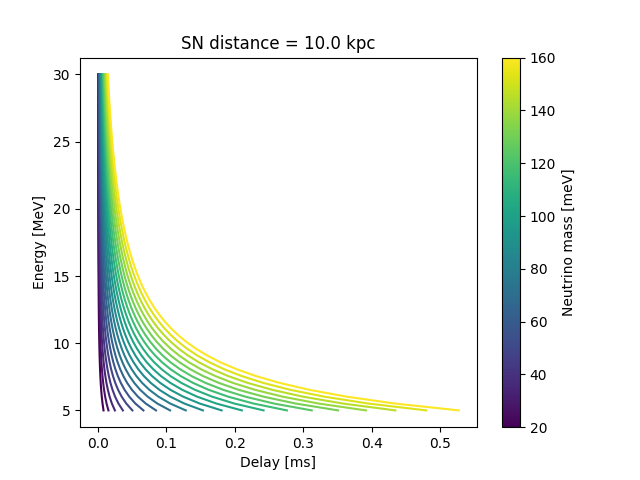

# Neutrino masses from failed supernovae

Can we measure the mass of neutrinos with a multi-messenger detection of a failed supernova?

The idea is the following: neutrinos being massive gives them a slight delay, which depends on energy: 

which looks like this:

So, in principle we can use this effect to measure their mass! 