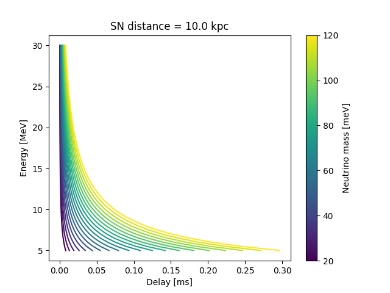

# Neutrino masses from failed supernovae

Can we measure the mass of neutrinos with a multi-messenger detection of a failed supernova?

The idea is the following: neutrinos being massive gives them a slight delay, which depends on energy: 
$$ \Delta t \approx \frac{D}{c} \frac{m^2}{E^2}
$$
which looks like this:

So, in principle we can use this effect to measure their mass! 
The effect is tiny, less than a millisecond, while the timescale for emission 
is quite long (on the order of 10 seconds) - how might we hope to detect such a signal then?

There is such a thing as a _failed supernova_: we know they happen (although they are quite rare),
they are supernova events for which, at early times ($\lesssim 1 \text{s}$) a black hole is formed,
which abruptly stops the neutrino and gravitational wave emission.

If this is abrupt enough, and if we have both gravitational wave and neutrino data for this event, 
then we can use the GWs to determine the emission end time, and compare to the last neutrino arrival;
if there is a measurable delay, this gives us a _lower bound on a single* neutrino mass_!

Actually, we're not measuring "a neutrino mass"; we will very likely observe the interaction 
of an electron antineutrino, and therefore measure 
$$ m_e = \sum _{i} U_{i e} m_i
$$
where $m_i$ are the three mass eigenstates, and $U$ is the flavor mixing matrix.

Let's make a list of the potential problems with this approach:

1. neutrino statistics: _is there at least one neutrino arriving later than the end of emission_?
1. GW end time determination uncertainty: _can we determine the end of GW emission within sub-millisecond accuracy_?
1. astrophysical delay systematics: the end of emission may not be as sharp as we would need,
   or there is a difference at the source between the end times of GW and neutrino emission.

## Neutrino statistics

The rate of detected neutrinos is given in the form 
$$ R = N_p \sigma \Phi \epsilon 
$$
where $N_p$ is the number of protons, $\sigma$ is the cross-section, $\Phi$ is the flux of neutrinos, $\epsilon$ is the detector efficiency (close to 1). 

## GW end time determination uncertainty

It seems [question during the ET OSB meeting to Adam Burrows] that there are no actual simulations
of the GW emission from failed supernovae. 

Until we have those, I work on a best-case-scenario hypothesis: I take a waveform from one of the 
supernovae they simulated ([here](https://arxiv.org/abs/1812.07703)) and chop it at an arbitrary time;
will I be able to recover the burst end time with sufficient precision?

Already the sampling rate is not wonderful 
- they give their waveforms at 16kHz, or 62.5microseconds between samples!

Sky localization error may be an issue: if there is no optical "counterpart"
(star disappering), the localization error may overcome this accuracy.

Barring that, is the end of the signal even detectable within <1ms? 
it seems like that's quite hard when we have even a low amount of noise. 

However, there may be a workaround! 
If the PNS collapses into a BH, it will have some leftover quadrupole, 
and it will emit QNMs! 

Are they detectable? Don't know! 
It'd be good to make some estimates.

It seems like nobody has GW simulations from failed SNe; write to David Radice! 
